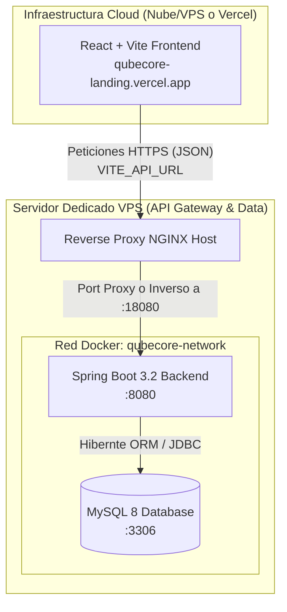

# Manual Técnico Completo e Ingeniería Arquitectónica de QubeCore

Este documento es la **Biblia técnica** del proyecto QubeCore. Describe de principio a fin cada capa, tecnología, flujo de datos y decisión arquitectónica de este portal orientado a ofrecer servicios y accesos de **Hardware Guiado y Consultoría en Computación Cuántica**. 

El software se modela bajo el patrón DAM (*Data Asset Management* limitado a la captura y categorización segura de peticiones B2B) integrado de manera monolítica escalable.

---

## 1. Visión Ejecutiva del Proyecto y Flujos Principales

QubeCore es la puerta de entrada a clientes corporativos que buscan soluciones cuánticas. El flujo vital transcurre de la siguiente manera:
1.  **Atracción B2B**: Un visitante llega a la Landing e interactúa con un rediseño de UI de super vanguardia (Animaciones dinámicas, "Glassmorphism").
2.  **Captación de Leads**: El usuario utiliza el módulo `Contact.jsx` (Formulario) exponiendo sus requerimientos sobre servicios específicos (Hardware, Formación, Soluciones Cloud Cuánticas).
3.  **Procesamiento Seguro**: El motor en Java de fondo (*Backend*) valida las reglas de negocio (ej. prevención de duplicados, saneado de inyección SQL), crea un registro histórico e instancia el estado inicial (`PENDIENTE`).
4.  **Gestión Privada**: Los líderes operativos se loguean en `/admin` (a través del `AdminPanel.jsx`), obtienen llaves maestras encriptadas en formato JWT, acceden a los datos de la corporación y cambian sus ciclos de vida entre revisiones y aprobaciones.

---

## 2. Topología Macro-Arquitectónica

---

## 3. Radiografía del Frontend (UI/UX Layer)

El Frontend está empacado mediante **Vite**, un orquestador ultra rápido impulsado por esbuild, sobre **React 19**.

### Herramientas y Bibliotecas
*   **TailwindCSS V4 y Variables CSS:** El diseño se compone vía Tailwind para disposición (flex, grid, márgenes) y Vanilla CSS (`index.css` y `App.css`) para variables nativas de colores como `--accent-cyan` que permiten un mantenimiento de theming más escalable a futuro.
*   **Framer Motion:** Maneja las interpolaciones espaciales en la UI. Permite que cuando los usuarios hagan "scroll", secciones como el **HardwareDeepDive** emerjan paulatinamente aportando robustez estética.
*   **tsParticles/react:** Sustentador del lienzo interactivo (`ParticlesBackground.jsx`), un canvas persistente de estrellas/nodos atómicos de fondo.

### Mapeo Fundamental de Componentes UI
*   `App.jsx`: El árbol raíz. Utiliza el API `window.location.popstate` de manera nativa para resolver si el usuario debe visualizar la Single Page corporativa promocional, o adentrarse a la ruta reservada de `/admin` y solapar o inyectar el `AdminPanel`.
*   `Contact.jsx`: Contiene el formulario de contacto B2B. Sus atributos son controlados asíncronamente (vía `useState`). Al invocar a `fetch()`, el envío desactiva el botón y renderiza estados visuales robustos de éxito o falla usando íconos contextuales de `lucide-react`.

### `AdminPanel.jsx` a fondo
Se encarga de la sesión de administrador sin necesidad de un framework SSR complejo.
1. Evalúa si el token JWT se halla en el `localStorage`.
2. Si no, renderiza una tarjeta de autenticación de "Acceso Táctico". Al emitir las flags al controlador del backend, recupera dicho token JWT y vuelve a redibujar el state interno.
3. Estando verificado, hace una validación dual asíncrona (`Promise.all()`) cargando simultáneamente la masa tabular con la lista de interacciones de empresas (solicitudes), **y en paralelo calculando las métricas estadísticas**.
4. Permite la edición en vivo vía `PATCH` HTTP del estado a (En Revisión, Aceptada, Borrada), desencadenado en una recarga reactiva de los conteos.

---

## 4. Radiografía del Backend (API / Logic Layer)

La columna vertebral en **Java**. Se ha optado por un ecosistema Spring Boot monolítico con estricta separación de dominios y Principios SOLID.

### Componentes de Dominio (Entities en `com.qubecore.model`)
El Domain Driven Design especifica cómo los datos se reflejarán biológicamente en MySQL.
*   **`Usuario`**: Extiende de la interfaz de seguridad nativa `UserDetails`. Otorga atributos lógicos de `activo`, `rol` (ENUM `ROLE_USER` / `ROLE_ADMIN`) y blindaje algorítmico al almacenar la variable `password`.
*   **`Servicio`**: Tabla maestra en caché, define los productos que vende de cara al público QubeCore. 
*   **`Solicitud`**: El documento en sí. Posee relaciones semánticas (un visitante solicita UN servicio), `CreationTimestamp` en JPA genera su rastro de auditoría sin intervenir el código, y dispone de `EstadoSolicitud` (ENUM que fuerza a las bases de datos a impedir inserciones anacrónicas que rompan la integridad).

### Capa de Acceso de Datos (`/repository`)
Existen tres interfaces usando `JpaRepository`. Simplifican por completo las transacciones SQL puras en memoria delegando todo a Hibernate. Ejemplo de query predictivo creado: `countByEstado(EstadoSolicitud estado)` genera subyacentemente un `SELECT count(s.id) FROM Solicitud s WHERE s.estado = ?1`.

### Capa de Negocio (`/service`)
Aísla las reglas organizacionales de los mecanismos de la red e internet (Controladores).
*   En `SolicitudService.java` encontramos heurística de negocio particular, tal como: *Si existe el email dado de alta para una métrica previa reciente, devuélvase Excepción `IllegalArgumentException("El email ya está registrado")`*. Ésto detiene que atacantes o scripts realicen un "Spam Flooding" del portal mediante inserciones masivas.

### Capa de Transferencia Segura (`/dto`)
Jamás exponemos nuestros Entes nativos y privados (Entities) hacia el internet ("DTO Pattern"). 
La Request llega transformada a `LoginRequest.java` o `SolicitudRequest.java`. En estas clases residen anotaciones Java Bean Validator (`@NotBlank`, `@Email`) que frenan en seco en capa de entrada HTTP cualquier código malicioso, liberando a la base de datos de tener que procesar cargas rotas o scripts malignos XSS. 

### Recepción, Gestión Restful (`/controller`)
El `SolicitudController` es el semáforo direccional, recibiendo payloads. 
Las etiquetas de Spring Security operan al nivel del Método de este semáforo (`@PreAuthorize("hasRole('ADMIN')")`).

---

## 5. El Corazón de la Seguridad y Autenticación Continua

Este software rechaza el esquema antiguo de Sesiones persistificadas de Tomcat para optimizar memoria al máximo (Stateless architecture). La solución de identidad es mediante **JWT (Json Web Tokens)**.

1. **`SecurityConfig`**: Impone a Spring arrancar con `csrf.disable()` y `sessionCreationPolicy(STATELESS)`. Añade además políticas CORS para que solo orígenes marcados previamente interactúen activamente con la red HTTP.
2. **`JwtTokenProvider`**: El ingeniero criptográfico. Utiliza una llave maestra secreta fortificada (`HS512 HMAC Algorithm`) inyectable mediante Variable de Entorno de SO, asegurando que si un tercero accede al base codebase o Git de QubeCore, nunca pueda emitir tokens falsos sin conocer el secreto de en servidor final. Configura también un delta de Expiración (`jwtExpirationMs`).
3. **`JwtAuthFilter`**: Hereda de `OncePerRequestFilter`. Cada vez que tú como administrador mueves el ratón, o refrescas, o borras un dato en el Front; NGINX propaga el Header `Authorization: Bearer <StringLargo>`.  Este filtro lo fragmenta, desencripta en base 64, valida el hash criptográfico matemático contra su firma, ubica en Memoria Viva temporal al usuario en `SecurityContextHolder`, le da poderes Admin y permite a Java ejecutar en fracción de milisegundos un `DELETE FROM solicitudes WHERE id = X`.

---

## 6. Arquitectura de Despliegue en Silos y Tolerante a Fallos

El ciclo final del código desemboca en una infraestructura diseñada como código (`Infrastructure as Code / IaC`):

### Estrategia Docker
*   El fichero **`Dockerfile` backend** tiene un patrón **"Multi-Stage"**. 
    1.  Toma una máquina voluminosa "Maven 3.9" y compila en binario la docena de ficheros Java.
    2.  Toma una micro-máquina pulcra ultraligera "Eclipse Temurin JRE Alpine" donde deposita sólo el compendio JAR de empaquetado, generando imágenes del servidor muy ligeras (~200MB) reduciendo ataque por superficie y eliminando repositorios y compiladores sucios del contenedor final en producción.
    3.  Despliega la salud mediante una corrutina en daemon ( `HEALTHCHECK CMD wget --no-verbose` ) certificando que MySQL se ha conectado exitosamente antes de que Nginx confíe tráfico sobre la aplicación web.

### Auto Sembrado de Bases de datos (`init-db/01-init.sql`)
La robustez permite un nivel Cero de manualidad. Ni bien se formatea el sector del disco donde el clúster transaccional va a radicar los datos de tablas (El `Volume` mysql_data persistente mapeado en disco de la VPS exterior), Docker inyecta un subrutinador semantizado donde introduce:
a)  Un usuario por defecto invulnerable del portal con hashing interno de `BCrypt()` `($2a$10$N9qo...)` que equivale a *Admin123!* .
b)  El glosario fijo de taxonomía de servicios que Qubecore ofertará al público dinámicamente.

### Control Global (`docker-compose.yml`)
El gran pegamento. Expone el mapa jerárquico. Reagrupa a estos ecosistemas y asigna parámetros que rescata recursivamente del fichero de enclaves `.env` hostigado en Servidor. En caso de colapso, el orquestador implementa políticas resilientes recursivas (`restart: unless-stopped`) haciendo que frente a un desbordamiento o kernel panic, Qubecore reviva automáticamente sin injerencia o mantenimiento humano primario. 

## 7. Futuro, Evolución y Patrones de Escalabilidad
Si mañana Qubecore levanta 1 Millón de interacciones / día B2B para peticiones de Hardware:
*   **En DB**: La máquina MySQL podrá dividirse a configuraciones tipo "Replica/Writer-Reader nodes" gracias al desacople.
*   **En Backend**: Spring Boot permite configurar Eureka o Spring Cloud con un par de anotaciones para duplicar infinitamente el despliegue del componente a modo de microservicio y auto-balancear de forma elástica bajo demanda computacional, ya que en la memoria RAM de esta arquitectura, "No se guardan las sesiones de usuarios de React". Todo está garantizado mediante llaves JWT Matemáticas desglosadas por las instancias.
*   **En Frontend**: El portal "Glassmorphism" exportable seguirá estático y alojado en Vercel Edge o CDN Cloud-flare sin sufrir repercusión ni un milisegundo por el procesamiento transaccional oculto detrás que elaboran  las Bases de datos.
