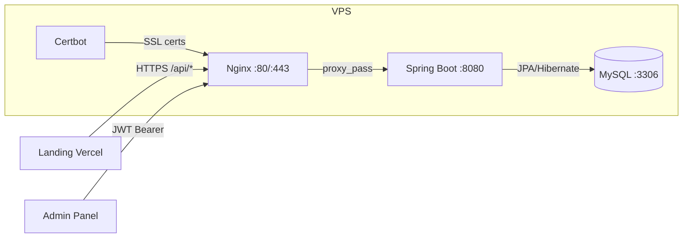

# QubeCore Backend — Walkthrough y Guía de Despliegue

## Resumen de lo creado

Se ha generado el backend completo de QubeCore con **31 ficheros fuente** organizados en capas:

### Estructura del proyecto

```
qubecore-backend/
├── Dockerfile                          # Multi-stage: Maven build → JRE Alpine
├── pom.xml                             # Spring Boot 3.2 + Security + JPA + JWT
├── src/main/java/com/qubecore/
│   ├── QubeCoreBackendApplication.java # Entry point
│   ├── config/SecurityConfig.java      # JWT stateless + CORS + roles
│   ├── controller/
│   │   ├── AuthController.java         # /api/auth/login, /register
│   │   ├── SolicitudController.java    # /api/solicitudes + /api/admin/*
│   │   └── ServicioController.java     # /api/servicios
│   ├── dto/                            # LoginRequest, RegisterRequest, JwtResponse, etc.
│   ├── exception/                      # GlobalExceptionHandler + ResourceNotFoundException
│   ├── model/                          # Usuario, Solicitud, Servicio + enums
│   ├── repository/                     # JPA repositories
│   ├── security/                       # JwtTokenProvider, JwtAuthFilter, UserDetailsService
│   └── service/                        # AuthService, SolicitudService, ServicioService
├── src/main/resources/application.properties
└── src/test/java/.../SolicitudControllerTest.java

docker-compose.yml                      # MySQL + Backend + Nginx + Certbot
nginx/nginx.conf                        # Reverse proxy con SSL + rate limiting
init-db/01-init.sql                     # Admin user + servicios iniciales
.env.example                            # Template de variables de entorno
```

### Endpoints API

| Método | Endpoint | Auth | Descripción |
|--------|----------|------|-------------|
| POST | `/api/auth/login` | — | Login → JWT |
| POST | `/api/auth/register` | — | Registrar usuario |
| GET | `/api/servicios` | — | Listar servicios (landing) |
| POST | `/api/solicitudes` | — | Crear solicitud (landing) |
| GET | `/api/admin/solicitudes` | ADMIN | Listar todas |
| GET | `/api/admin/solicitudes?estado=PENDIENTE` | ADMIN | Filtrar por estado |
| PATCH | `/api/admin/solicitudes/{id}/estado` | ADMIN | Cambiar estado |
| DELETE | `/api/admin/solicitudes/{id}` | ADMIN | Eliminar |
| GET | `/api/admin/solicitudes/estadisticas` | ADMIN | Dashboard stats |

---

## 🚀 Guía de Despliegue en VPS

### Requisitos previos en la VPS

- **Ubuntu 22.04+** (o cualquier Linux con Docker)
- **Docker** y **Docker Compose** instalados
- **Dominio** apuntando a la IP de la VPS (ej: `api.qubecore.es`)
- **Puerto 80 y 443 abiertos** en el firewall

### Paso 1: Instalar Docker en la VPS

```bash
# Conectar a la VPS
ssh root@TU_IP_VPS

# Instalar Docker
curl -fsSL https://get.docker.com | sh

# Instalar Docker Compose plugin
apt install docker-compose-plugin -y

# Verificar
docker --version
docker compose version
```

### Paso 2: Subir el proyecto a la VPS

```bash
# Opción A: Con Git (recomendado)
cd /opt
git clone https://github.com/TU_USUARIO/qubecore-landing.git
cd qubecore-landing

# Opción B: Con SCP desde tu máquina local
scp -r /home/alejandro/Documentos/aintropic\ proyect/qubecore-landing root@TU_IP_VPS:/opt/qubecore-landing
```

### Paso 3: Configurar variables de entorno

```bash
cd /opt/qubecore-landing

# Copiar el template
cp .env.example .env

# Editar con tus contraseñas SEGURAS
nano .env
```

> [!CAUTION]
> **Cambia TODAS las contraseñas** del `.env` antes de desplegar. Genera el JWT_SECRET con:
> ```bash
> openssl rand -base64 64
> ```

Contenido del `.env`:
```properties
MYSQL_ROOT_PASSWORD=UnaPasswordRootMuyFuerte!2024
MYSQL_DATABASE=qubecore
MYSQL_USER=qubecore_user
MYSQL_PASSWORD=UnaPasswordUserMuyFuerte!2024
JWT_SECRET=PegaAquiElResultadoDeOpenSSLRand64
JWT_EXPIRATION=86400000
DOMAIN=api.qubecore.es
```

### Paso 4: Configurar SSL con Let's Encrypt

```bash
# Primero, arranca Nginx sin SSL para obtener el certificado
# Comenta las líneas de ssl_certificate en nginx/nginx.conf temporalmente

# Obtener certificado
docker run --rm \
  -v ./certbot/www:/var/www/certbot \
  -v ./certbot/conf:/etc/letsencrypt \
  certbot/certbot certonly \
  --webroot \
  --webroot-path /var/www/certbot \
  -d api.qubecore.es \
  --email tu@email.com \
  --agree-tos \
  --no-eff-email

# Descomenta las líneas de SSL en nginx.conf
```

**Alternativa rápida sin SSL** (para pruebas): Comenta el bloque `server { listen 443 ... }` en `nginx.conf` y cambia el redirect 301 del bloque `listen 80` a un proxy_pass directo.

### Paso 5: Levantar todo

```bash
cd /opt/qubecore-landing

# Construir y arrancar en segundo plano
docker compose up -d --build

# Ver los logs en tiempo real
docker compose logs -f

# Verificar que todo está corriendo
docker compose ps
```

> [!TIP]
> La primera vez tarda ~2-3 minutos porque Maven descarga todas las dependencias. Las siguientes builds son más rápidas gracias al cache de Docker.

### Paso 6: Verificar

```bash
# Comprobar que el backend responde
curl http://localhost:8080/api/servicios

# Probar login con el admin por defecto
curl -X POST http://localhost:8080/api/auth/login \
  -H "Content-Type: application/json" \
  -d '{"email":"admin@qubecore.es","password":"Admin123!"}'
```

> [!WARNING]
> El usuario admin por defecto tiene password `Admin123!`. **Cámbialo inmediatamente** después del primer login. El hash BCrypt del `01-init.sql` corresponde a esa password — genera uno nuevo con:
> ```bash
> docker exec -it qubecore-backend java -cp app.jar \
>   org.springframework.security.crypto.bcrypt.BCryptPasswordEncoder
> ```

### Paso 7: Apuntar el dominio

En tu proveedor DNS, crea un registro **A**:

| Tipo | Nombre | Valor |
|------|--------|-------|
| A | `api.qubecore.es` | `TU_IP_VPS` |

### Paso 8: Conectar la landing al backend

En tu landing de Vite, actualiza la URL del backend:

```javascript
// En tu código frontend
const API_URL = "https://api.qubecore.es";

// Ejemplo: enviar solicitud
const res = await fetch(`${API_URL}/api/solicitudes`, {
  method: "POST",
  headers: { "Content-Type": "application/json" },
  body: JSON.stringify({ nombre, email, empresa, telefono, mensaje, servicioId })
});
```

---

## Comandos útiles

```bash
# Parar todo
docker compose down

# Parar y borrar volúmenes (¡BORRA LA BASE DE DATOS!)
docker compose down -v

# Reconstruir solo el backend
docker compose up -d --build backend

# Ver logs del backend
docker compose logs -f backend

# Entrar a la base de datos
docker exec -it qubecore-mysql mysql -u qubecore_user -p qubecore

# Backup de la base de datos
docker exec qubecore-mysql mysqldump -u root -p qubecore > backup_$(date +%F).sql
```

---

## Diagrama de la arquitectura desplegada


